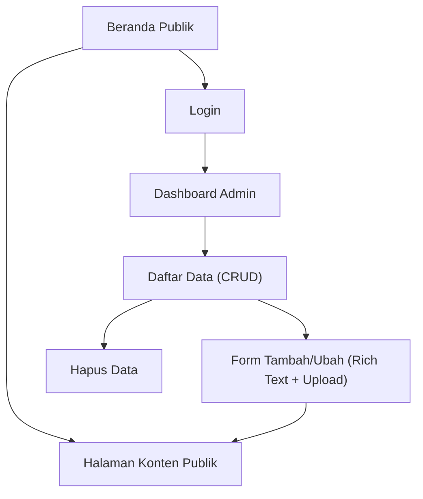

## 1. Product Overview
Porting seluruh dashboard berbasis React menjadi aplikasi Laravel server-rendered (Blade + Alpine) tanpa kehilangan fitur.
Targetnya adalah parity fitur (CRUD, upload file, rich text) serta penyempurnaan halaman publik yang saat ini belum lengkap.

## 2. Core Features

### 2.1 User Roles
| Role | Registration Method | Core Permissions |
|------|---------------------|------------------|
| Pengunjung (Publik) | Tidak perlu registrasi | Mengakses halaman publik dan membaca konten yang dipublikasikan |
| Pengguna Internal (Admin/Editor) | Dibuat oleh Admin / existing user | Login, mengelola data (CRUD), mengunggah file, mengedit konten rich text, mempublikasikan konten |

### 2.2 Feature Module
Kebutuhan produk terdiri dari halaman utama berikut:
1. **Beranda Publik**: navigasi global, section konten utama, CTA, footer.
2. **Halaman Konten Publik**: menampilkan konten per slug (halaman statis/berita/artikel sesuai struktur saat ini), komponen rich content.
3. **Login**: autentikasi pengguna internal.
4. **Dashboard Admin**: ringkasan, manajemen data (CRUD), form create/edit dengan upload + rich text, pengaturan status publikasi.

### 2.3 Page Details
| Page Name | Module Name | Feature description |
|-----------|-------------|---------------------|
| Beranda Publik | Header & Navigasi | Menampilkan menu publik (beranda + tautan halaman publik yang tersedia) dan state aktif.
| Beranda Publik | Konten Utama | Menampilkan section/komponen yang sebelumnya ada di public pages React; memastikan konten tidak kosong dan tata letak rapi.
| Beranda Publik | Footer | Menampilkan informasi dasar (copyright, tautan penting).
| Halaman Konten Publik | Resolusi Konten via Slug | Memuat konten berdasarkan slug/URL; menampilkan 404 bila tidak ditemukan.
| Halaman Konten Publik | Rendering Rich Text | Merender HTML hasil editor rich text dengan sanitasi/whitelist yang aman.
| Halaman Konten Publik | Media di Konten | Menampilkan gambar/file yang di-embed dari hasil upload.
| Login | Form Login | Memvalidasi input, autentikasi, redirect ke dashboard bila sukses.
| Login | Error Handling | Menampilkan pesan gagal login dan mempertahankan input yang aman.
| Dashboard Admin | Navigasi Admin | Menyediakan menu modul CRUD yang setara dengan dashboard React; menampilkan hak akses dasar.
| Dashboard Admin | Daftar Data (CRUD - Read) | Menampilkan tabel/list data per modul, pagination, pencarian sederhana (bila ada di React).
| Dashboard Admin | Tambah/Ubah Data (CRUD - Create/Update) | Menyediakan form create/edit dengan validasi; mendukung field rich text dan upload.
| Dashboard Admin | Hapus Data (CRUD - Delete) | Menghapus data dengan konfirmasi.
| Dashboard Admin | Upload File | Mengunggah file (mis. gambar/dokumen) dari form; menyimpan metadata file; menampilkan preview.
| Dashboard Admin | Status Publikasi | Mengatur status tayang/draft (bila ada di sistem saat ini) untuk mempengaruhi halaman publik.
| Dashboard Admin | Audit Parity Halaman Publik | Mencatat bagian public pages yang belum lengkap dan menyelesaikan parity komponen/layout.

## 3. Core Process
**Alur Pengunjung (Publik)**
1. Kamu membuka Beranda Publik.
2. Kamu menavigasi ke Halaman Konten Publik dari menu/tautan.
3. Sistem memuat konten berdasarkan slug dan merender rich text + media.

**Alur Pengguna Internal (Admin/Editor)**
1. Kamu membuka halaman Login dan masuk.
2. Kamu masuk ke Dashboard Admin dan memilih modul data.
3. Kamu melihat daftar data, lalu menambah/mengubah/menghapus data.
4. Saat mengedit konten, kamu dapat menulis rich text dan mengunggah file.
5. Kamu menyimpan perubahan dan (bila berlaku) mengatur status publikasi agar tampil di halaman publik.

