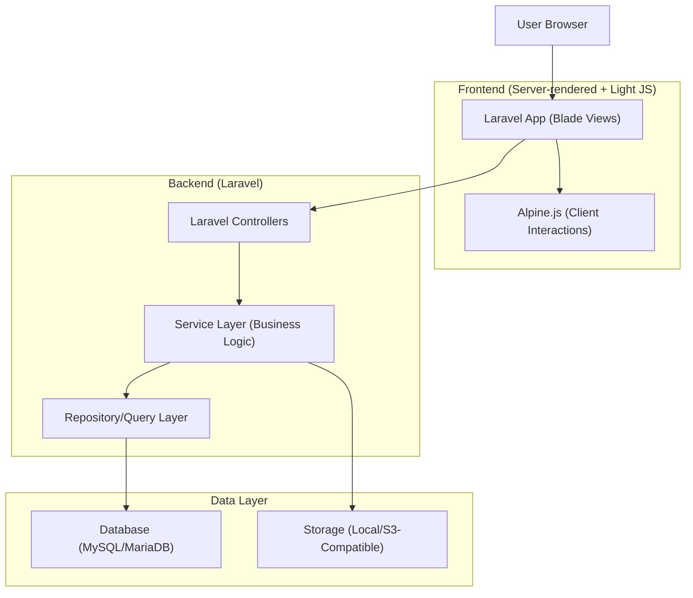
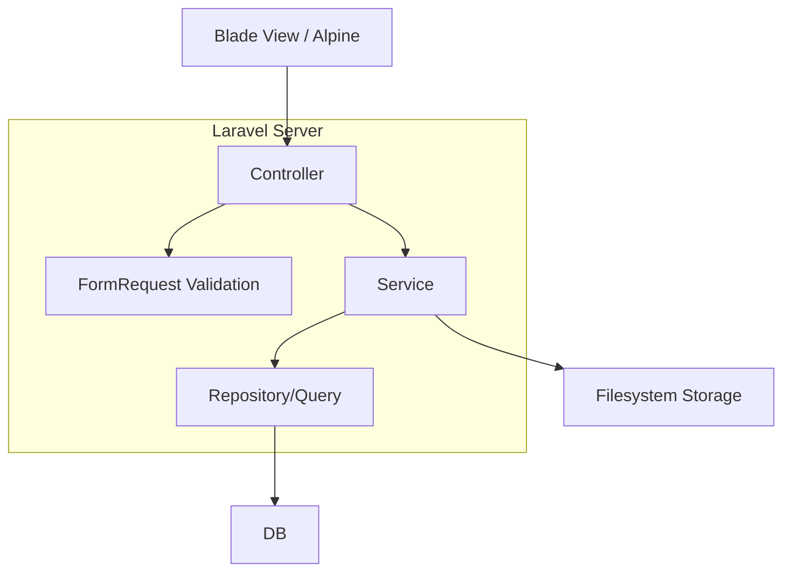
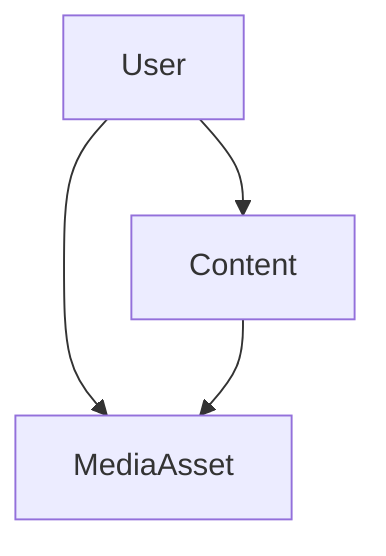

## 1.Architecture design


## 2.Technology Description
- Frontend: Laravel Blade + Alpine.js@3 + tailwindcss@3 + Vite
- Backend: Laravel@11 (PHP 8.2+) + Laravel Auth scaffolding (mis. Breeze)
- Database: MySQL/MariaDB
- File Upload: Laravel Filesystem (local untuk dev, S3-compatible untuk production)
- Rich Text: Editor JS terintegrasi di Blade (mis. CKEditor 5 / TinyMCE) + sanitasi output saat render

## 3.Route definitions
| Route | Purpose |
|-------|---------|
| / | Beranda publik (komponen/layout yang dipadatkan dan dilengkapi) |
| /p/{slug} | Halaman konten publik berdasarkan slug (render rich text + media) |
| /login | Login pengguna internal |
| /logout | Logout |
| /admin | Landing dashboard admin (ringkasan + navigasi modul) |
| /admin/{module} | List/pencarian/pagination data per modul (CRUD read) |
| /admin/{module}/create | Form tambah data (CRUD create) |
| /admin/{module}/{id}/edit | Form ubah data (CRUD update) |
| /admin/{module}/{id} | Delete data (CRUD delete) |
| /admin/uploads | Endpoint/manajer upload (opsional sebagai halaman) |
| /admin/uploads/store | Endpoint upload file dari form (biasanya JSON response) |

## 4.API definitions (If it includes backend services)
Catatan: Aplikasi utama server-rendered, namun upload biasanya memakai endpoint JSON agar UX lebih cepat.

### 4.1 Upload File (JSON)
```
POST /admin/uploads/store
```
Request (multipart/form-data):
| Param Name| Param Type | isRequired | Description |
|---|---|---|---|
| file | binary | true | File yang diunggah |
| context | string | false | Konteks modul/form yang memakai file |

Response (JSON):
| Param Name| Param Type | Description |
|---|---|---|
| id | string | ID media asset |
| url | string | URL file untuk preview/embed |
| mime | string | Tipe MIME |
| size | number | Ukuran file |

### 4.2 CRUD Modul (Server-rendered)
Konvensi: resourceful routes + FormRequest untuk validasi.
- GET /admin/{module}
- GET /admin/{module}/create
- POST /admin/{module}
- GET /admin/{module}/{id}/edit
- PUT/PATCH /admin/{module}/{id}
- DELETE /admin/{module}/{id}

## 5.Server architecture diagram (If it includes backend services)


## 6.Data model(if applicable)
### 6.1 Data model definition
Fokus porting adalah mempertahankan skema domain yang sudah ada (1:1 parity). Minimal entity tambahan untuk kebutuhan upload + konten publik:
- User: pengguna internal.
- Content: konten publik berbasis slug dan body rich text.
- MediaAsset: metadata upload untuk gambar/dokumen.



### 6.2 Data Definition Language
Contoh minimal (bisa disesuaikan agar cocok dengan skema existing):

User Table (users)
```
CREATE TABLE users (
  id BIGINT UNSIGNED PRIMARY KEY AUTO_INCREMENT,
  name VARCHAR(100) NOT NULL,
  email VARCHAR(255) UNIQUE NOT NULL,
  password VARCHAR(255) NOT NULL,
  created_at TIMESTAMP NULL,
  updated_at TIMESTAMP NULL
);
```

Content Table (contents)
```
CREATE TABLE contents (
  id BIGINT UNSIGNED PRIMARY KEY AUTO_INCREMENT,
  slug VARCHAR(190) UNIQUE NOT NULL,
  title VARCHAR(255) NOT NULL,
  body_html MEDIUMTEXT NULL,
  status VARCHAR(20) NOT NULL DEFAULT 'draft',
  author_id BIGINT UNSIGNED NULL,
  published_at TIMESTAMP NULL,
  created_at TIMESTAMP NULL,
  updated_at TIMESTAMP NULL
);
```

MediaAsset Table (media_assets)
```
CREATE TABLE media_assets (
  id BIGINT UNSIGNED PRIMARY KEY AUTO_INCREMENT,
  disk VARCHAR(50) NOT NULL DEFAULT 'public',
  path VARCHAR(500) NOT NULL,
  url VARCHAR(800) NULL,
  original_name VARCHAR(255) NULL,
  mime VARCHAR(100) NULL,
  size BIGINT UNSIGNED NULL,
  uploader_id BIGINT UNSIGNED NULL,
  created_at TIMESTAMP NULL,
  updated_at TIMESTAMP NULL
);
```
